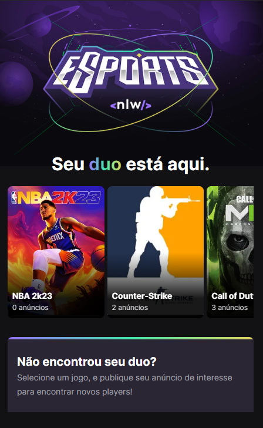

<h1 align="center">⚽ NLW Esports ⚽</h1>

<p align="center">  <a href="#sobre">Sobre</a> • <a href="#layout">Layout</a> • <a href="#aplicacao">Aplicação</a>  • <a href="#techs">Tecnologias</a> • <a href="#licenca">Licença</a> </p>

  <h2 id="sobre"> 📋 Sobre o projeto</h2>
  
  O projeto se chama Find your Duo. É uma plataforma para encontrar o parceiro perfeito para jogar seu jogo favorito juntos, conectando sua conta Twitch.

<h2 id="layout"> 🎨  Layouts</h2>

<p align="center">
	
  
</p>

<h2 id="aplicacao"> 🎲  Rodando essa aplicação:</h2>

Antes de começar, você vai precisar ter instalado em sua máquina as seguintes ferramentas: [Git](https://git-scm.com/), [Node.js](https://nodejs.org/en/), [Yarn](https://yarnpkg.com/). Além disto é bom ter um editor para trabalhar com o código como [VSCode](https://code.visualstudio.com/).

```
# Clone este repositório
$ git clone https://github.com/wesleywisch/NLW-Esports-Trilha-Ignite.git

# Acesse a pasta do projeto no terminal
$ cd backend, depois cd frontend e cd mobile

# Instale as dependências
$ npm install ou yarn

# Execute a aplicação
$ yarn start ou npm run start

# O app estará disponível no seu browser pelo endereço - http://localhost:3000
```

 <h2 id="techs"> 💻 Tecnologias</h2>
 As seguintes ferramentas foram usadas na construção do projeto:

- [Next]()
- [React]()
- [Typescript]()
- [Tailwindcss]()
- [NodeJs]()
- [Prisma]()
- [React Native]()
- [Expo]()
- [Radix Ui]()

<h2 id="licenca"> ⚠️  Licença</h2>

Esse projeto esta sobre a licença [MIT]().
